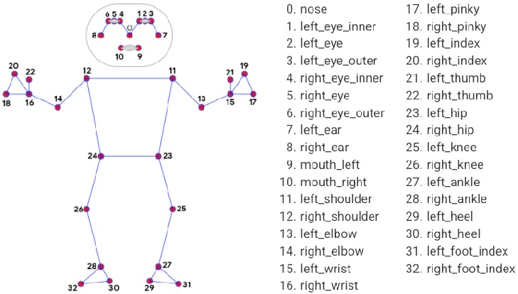

## 🎮 Street Fighter con MediaPipe Pose  

El proyecto consiste en una **implementación interactiva del juego Street Fighter**, en la cual se emplea la tecnología de **MediaPipe Pose** para interpretar los **gestos corporales del usuario** y convertirlos en **comandos de control del personaje**.

### ⚙️ ¿Cómo funciona?  

Mediante el uso de **OpenCV** para la **captura de video**, **MediaPipe Pose** para la **detección y seguimiento de puntos clave del cuerpo**, y **PyDirectInput** para la **simulación programática de entradas del teclado**, el sistema permite que el jugador ejecute acciones dentro del juego utilizando exclusivamente los **movimientos de su cuerpo**.



De esta forma, se reemplaza el **esquema tradicional de control físico** por una interfaz de interacción basada en **detección de poses**, proporcionando una experiencia más **inmersiva, dinámica y natural** en el entorno de combate.

### 🕹️ Movimientos implementados  

- ✊ **Golpe Izq–Der** → Movimiento rápido del brazo hacia adelante.  
- 🦶 **Patada Izq–Der** → Elevación de la pierna a determinada altura.  
- 🚶 **Avanzar** → Desplazamiento corporal hacia adelante.  
- 🔙 **Retroceder** → Desplazamiento corporal hacia atrás.  
- 🕴️ **Saltar** → Detección de aumento repentino en la posición del cuerpo.  
- 🧎 **Agacharse** → Disminución notable de la altura del cuerpo (flexión de rodillas).  
- 🔥 **Hadouken** → Movimiento simultáneo de ambos brazos hacia adelante, simulando el clásico ataque de energía.  


Equipo
```
Aqué González José Manuel 
Obed Domínguez Mora
Ortiz Valle Leonardo Yeret
```