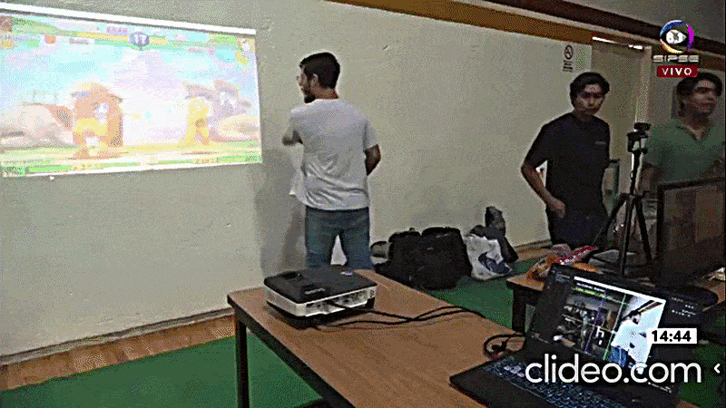

## 🎮 Street Fighter with MediaPipe Pose

This project features an **interactive implementation of Street Fighter**, utilizing **MediaPipe Pose** technology to interpret **user body gestures** and translate them into **character control commands**.

  

### ⚙️ How it Works

By leveraging **MediaPipe Pose** for the **detection and tracking of body keypoints**, **OpenCV** for **video capture**, and **PyDirectInput** for the **programmatic simulation of keyboard inputs**, the system enables players to execute in-game actions using exclusively their **body movements**.

This approach replaces the **traditional physical controller scheme** with an interaction interface based on **pose detection**, delivering a more **immersive, dynamic, and natural experience** within the combat environment.

### 📥 Installation & Setup

**Download the MAME Emulator:**
   - [**DOWNLOAD HERE**](https://www.mamedev.org/)

### 📷 Camera Setup
For optimal pose detection, please ensure your environment meets the following criteria:

- **Distance:** Position yourself approximately **1.7 meters** away from the camera.
- **Height:** The camera should be placed at a height of **1.45 meters** from the floor.
- **Lighting:** Ensure the room is well-lit for accurate body tracking.

### ⚖️ Calibration (Critical)
When you run the script, the system requires a brief initialization phase:

1. **Stand Still:** Face the camera directly. Remain perfectly still for **5 seconds** (do not move your arms, torso, or head).
2. **Combat Stance:** After the 5-second calibration is complete, **turn 90 degrees to your right**.
3. **Start:** You are now ready to control the character and begin fighting!

### 💿 Emulation Specs
This system has been calibrated and tested using the following specific versions:
- **Emulator:** MAME 0.281
- **Game:** Street Fighter Alpha 3

### 🕹️ Implemented Moves

- ✊ **L/R Punch** → Rapid arm movement forward.
- 🦶 **L/R Kick** → Leg elevation to hip height.
- 🚶 **Move Forward** → Body displacement forward.
- 🔙 **Move Backward** → Body displacement backward.
- 🕴️ **Jump** → Detection of a sudden upward change in body position.
- 🧎 **Crouch** → Notable decrease in body height (knee flexion).
- 🔥 **Hadouken** → Simultaneous movement of both arms forward, simulating the classic energy attack.

